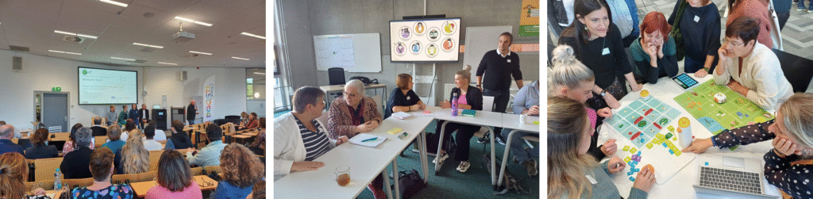

# 

# Promoting Inclusive Computational Thinking: CoTEDI Multiplier Event in The Netherlands

The Multiplier Event held in Heerlen (The Netherlands) from 3 to 5 October 2024 brought together educators, researchers, and policymakers as part of the Erasmus+ CoTEDI project. The event was hosted by the Dutch partner and took place at the campus of the Open University and at BS de Horizon primary school, where real classroom settings supported the implementation of the project’s activities.

The programme included presentations, workshops, and discussions focused on the inclusive development of computational thinking skills in early and primary education. A special emphasis was placed on the experiences from the CoTEDI pilot activities and teacher training initiatives conducted across different partner countries. The participants also engaged in hands-on sessions using unplugged and digital materials designed to make computational thinking accessible to all learners, including those with special educational needs.

This Multiplier Event served not only to disseminate the project results but also to build a collaborative network of professionals committed to fostering inclusive and innovative practices in education through computational thinking.

