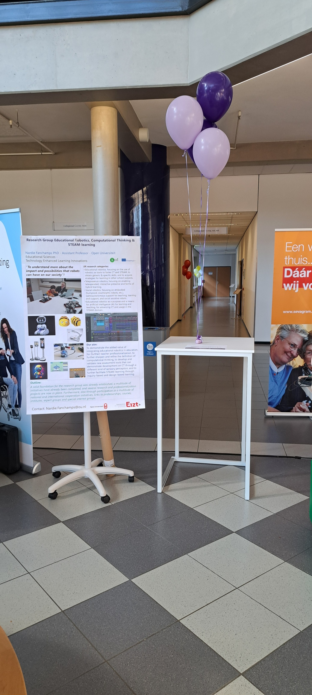

On March 6th, 2024, Dr. Nardie Fanchamps pitched the CoTEDI Project at the [Zuyd University Technology Experience Day](https://ted24.nl).

As part of the Technology Experience Day (TED) as organised by Zuyd University of Applied Sciences in 2024, the Open University of the Netherlands was present as the lead partner for the CoTEDI project. Through an activating poster presentation, interested parties were informed about the central objectives and intended benefits of the CoTEDI project, and how it connects to the OU research group on educational robotics, computational thinking & STEAM-learning. This generated a lot of interest and new involvement for creating knowledge networks, with secondary and higher education also showing a great interest. More information regarding TED can be obtained via the link: https://ted24.nl/

[Download Nardie's poster here](Poster_TED_Research_Group_06-03-2024.pdf)

