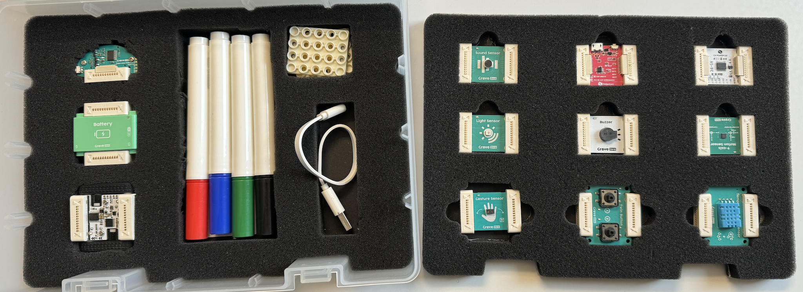

CoTEDI&#39;s Christian Glahn and Roland Klemke moderated a workshop on using robots to learn and teach with robots at the [JTEL Summer School 2024](https://ea-tel.eu/jtelss24) in Gabicce Mare, Pesaro, Italy on 18th May 2024. 20 Ph.D.-candidates from the field of technology-enhanced learning learned and engaged with [Grove Zero Robots](https://www.seeedstudio.com/TinkerGen-Grove-Zero-c-1984.html) and explored [ZHAW&#39;s](https://dxi.ai/2021/08/22/memn/) ideas on *contextual tangible computational thinking without code*.

### Concept of the workshop 

The workshop drew on ZHAW's previous experiences in the [Machen Können project](https://dxi.ai/2021/08/22/memn/) by repurposing the core educational programme from school visits. The emphasis of the workshop was on creative engagement and exploration, while focusing on different aspects of computational thinking such as functions, loops and branching through the tangible interfaces of the robot. 

The workshop centered around experiencing creative exploration of computational thinking concepts. Like many other digital appliances, the robots used in the workshop were provided as is and couldn't get altered programmatically during the workshop. This means that the participants could "program" the robots only by arranging the robot's components as well as creating an environment for the robots to act. For shaping the robot's enviornment, the participants were provided with large sheets of paper, color pens and basic lego bricks. This requires the participants to focus on the behaviour of the robot and identify its inherent logic through these observations. 

In schools we observed that this tangible interactions suported students to engage with computational logic who were otherwise distracted by the semantics of the programming language taught. In this workshop, we were interested in the computational concepts the paperticipants observered and how they balanced their intentions with the robot's capabilities. 

### Workshop Outline and Material 

With less than three hours available, the workshop focused only on the tangible concepts of computational thinking. The workshop slides are [available for download](20240517_jtelss_robots_computational_thinking.pdf).

#### Objectives and Tasks

The workshop's core objective was the experience of tangible strategies to computational thinking through creative exploration. This means that apart from the robot components, the participants had no additional information about the robot's behaviour, triggers, and interpretration of sensory data. Therefore, the participants needed to identify the robotic functions by experimentation. 

The workshop had four parts that were performed in small teams. Each part added complexity to the scenario. All parts were explorative as only the general objective was given but the actual solution was left to the participants' choice. For each part the teams were asked to document their findings to replication by teachers in the classroom using an online form. This form included the exploration strategy, components considered, the computational thinking concepts deiscovered, preparation activities, and potential pitfalls they have discovered. 

First, the participants needed to find out about sensing and acting components of the robotic kit. They were asked to figure out how the different components integrate. This exercise allowed the participants to familiarize themselves with the different sensors and interfaces. While minimal combinations of one sensor with one actuator (motor, light, sound) are always defined, not all combinations of sensors and actuators lead to meaningful results.

Second, the participants were asked to create a race track for robots by drawing lines on a large sheets of paper. This task was introduced by the title *follow the line and the colors*. This task required the participants to explore how to create a mobile robot that is able to find traces of color in its surrounding. As different colors have different meanings in the predesigned behaviour of the robot, the participants needed to explore the logic underpinning the seemingly random movements.

Third, the participants had to explore other sensors for controling the movements of their robot. The title *follow the hand* indicated to use the gesture or button sensors, but it could be extended to use also the sound sensor of the kit, so the activity turned quickly into *follow my voice*. 

The final activity asked each two teams rebuild their robots so they collaborate. This required the participants to think how the behaviour of the robots could influence each other. This task required the participants to integrated the previous activities and merge them into an interaction between two robots. The only cue was that the robots needed to work together. It was for the creativity of the participants to define the kind and level of cooperation of their robots.

#### Grove Zero Computational Thinking kits

The Grove Zero bundles different robot components into kits. In order to allow for more playful interactions ZHAW has combined the [Grove Zero Starter Kit](https://www.seeedstudio.com/Grove-Zero-Starter-Kit-V2-0-p-4352.html) and the [Grove Zero Car Kit](https://www.seeedstudio.com/Grove-Zero-Car-Kit-V2-0-p-4351.html) into a custom kit tailored to a wider range of educational objectives as found at different levels. At a cost of less than 200€ per kit this offers a stepwise transition from tangible interactions via block based programming all the way to advanced sensor-actuator-programming. 

Different to other approaches and systems, the Grove Zero approach minimizes initial building complexity and allows for immediate successes through pre-build software logic build into the components. While this initial logic is limited, it can be completely replaced by using the [Scratch Language](https://scratch.mit.edu/). As Grove Zero builds on a Arduino-compliant microcontroller, advanced students can write complex solutions as they would with Arduino boards, BBC Microbits, or the Raspberry PI Pico. This flexibility allows for creating tailored solutions for specific inclass learning objectives that allow pupils to focus on their robot interactions. Combined with the intuitive magnetic connectors we find that this approach particularly useful for working with diverse classes at primary school level. 

### Participant Solutions

The Grove Zero Framework was new to all participants, but were otherwise knowledgable in at least one programming language. After a brief exploration of the provided kits, it became clear that the participants needed to overcome dissonances between their intentions and expectations, on the one hand, and the acutal functions of the robots, on the other. Some of these dissonances required supportive interventions by the moderator. As the interactions with the robot kit are simple, it was only required to ask reflection questions to the participants so they can develop their own solutions.  

It showed that the ease of reconfigurability of the robots was a vital factor for the immersive experience of the participants. This helped the participants to extend and remove functions of their robots, quickly. In this turn one group observed that turn-taking is important to work around the eagerness of some individuals in a team. This is particularly important when working with "larger" groups of 4 to 5 persons. 

The participants observed several high-level computational thinking concepts. This perspective is interesting and important because in CoTEDI we want to provide guidance about the granularity of the underpinning concepts and skills.

