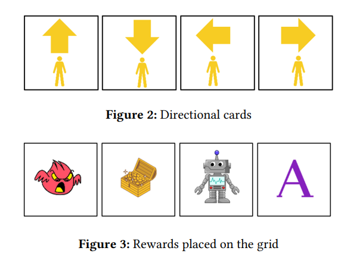

# Integrating Programmable Robots to Foster Computational Thinking in Early Childhood Classrooms

**This work is co-funded by the Erasmus+ project CoTEDI, which is also co-financed by the European Union under the call-key action 2023-1-NL01-KA220-SCH-000152037 – OID E10207981**

Gamarra-Expósito, A., Martín-Barroso, E., & Zapata-Cáceres, M. (2025). Integrating Programmable Robots to Foster Computational Thinking in Early Childhood Classrooms. *Proc. Special Issue on Innovations and Applications of Educational Robots and Robotics (EduRobotX SIG, EATEL), CEUR-WS EduRobotX*.

**Abstract.** Computational thinking and educational robotics are becoming key competencies for creating  
competent digital citizens in today’s world. The development of these skills has been gradually  
implemented in Primary and Secondary Education, but there is still a long way to go, especially in  
their use in Early Childhood Education. The use of these technologies from an early age has shown to  
have positive effects on students’ education. This paper presents an intervention among 3-year-old  
students using the Bee-Bot robot. The study includes both unplugged activities and activities with the  
robot to develop computational thinking skills. The results show an improvement in the acquisition of  
these concepts with meaningful learning after conducting the robotics sessions. Additionally, the  
obtained results are analysed and options for their improvement are discussed. The difficulties and  
limitations of this study are also addressed.

<https://ceur-ws.org/Vol-3997/short1.pdf>

