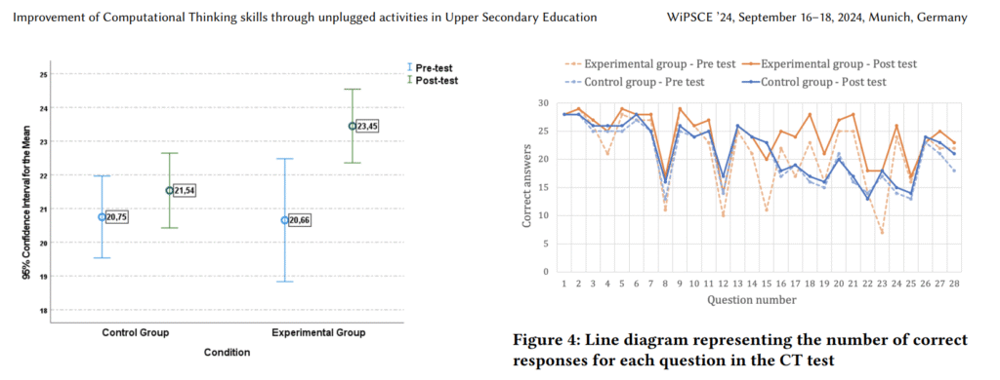

# Improvement of Computational Thinking skills through unplugged activities in Upper Secondary Education

**This work is co-funded by the Erasmus+ project CoTEDI, which is also co-financed by the European Union under the call-key action 2023-1-NL01-KA220-SCH-000152037 – OID E10207981**

Benavides-Escola, C. A., Martín-Barroso, E., Zapata-Cáceres, M., & Román-González, M. (2024, September). Improvement of Computational Thinking skills through unplugged activities in Upper Secondary Education. In *Proceedings of the 19th WiPSCE Conference on Primary and Secondary Computing Education Research* (pp. 1-9).

**Abstract.** The adoption of Computational Thinking (CT) in the educational worldwide curricula is progressively gaining importance from various perspectives. One particular approach, known as unplugged, does not require electronic devices and offers notable benefits as it is replicable and adaptable. Moreover, it serves to dismantle the misconception that computer science is exclusively confined to the digital realm. While both plugged and unplugged methodologies are recognized, further exploration of the unplugged approach is required, especially in Upper Secondary Education, where there is less evidence of its effectiveness. This paper presents a summary of a quasi-experimental study conducted with 11th grade students (approximately 16 years old) in a Spanish public high school. 57 students participated: 28 in the control group and 29 in the experimental group. The conducted research, based on a quantitative and experimental design, aimed to investigate the effectiveness of unplugged activities to improve CT abilities in Upper Secondary Education. The results indicated improved skills in the experimental group, suggesting the potential efficacy of unplugged methods in fostering CT abilities.

[Improvement of Computational Thinking skills through unplugged activities in Upper Secondary Education | Proceedings of the 19th WiPSCE Conference on Primary and Secondary Computing Education Research](https://doi.org/10.1145/3677619.3678110)

