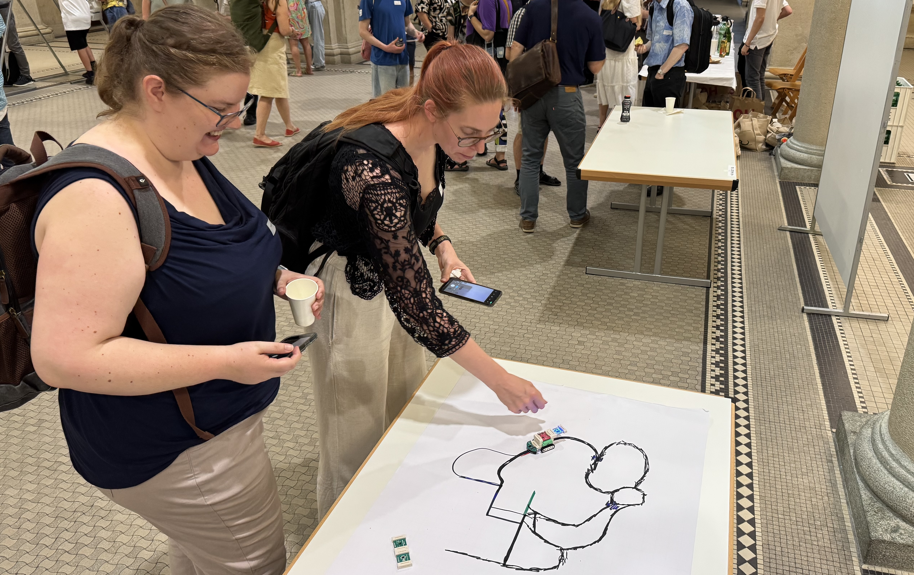
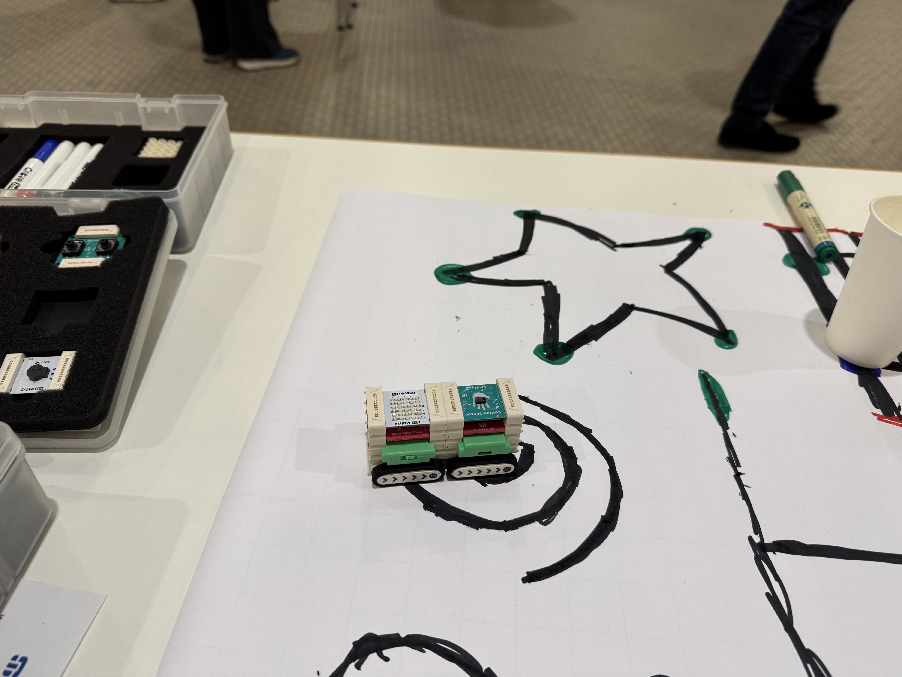

CoTEDI was present with a booth at the STIU mini conference and [national Bebras finals](https://www.informatik-biber.ch/).  We offered a hands conceptual presentation as well as hands on experiences of our principles using the ZHAW Act-up module using the Grove Zero modular robot. This provided good experiences for, both, teachers and students to learn about computational thinking and robots. 

The modular format of the robot attracted many teachers. Similar to students in classrooms, they were asked to touch and handle the robot themselves and collect their own experiences of the concepts. They showed interest in the mobile digital life science lab and the complementary educational material we currently develop in the project. One important aspect that teachers expressed was the importance of having expert support when integrating such concepts into their own teaching and educational experiences. 

Of course most students present were finalists in the Bebras competition and were already fluent in many of the core concepts we target in the project. Still the experience proved to be a nice counter part to the formal program of the day. The students of all age groups actively explored sensors and actuators for contextual programming using pens and paper.

[Fetch the CoTEDI poster!](https://github.com/user-attachments/files/20934050/2025_STIU-Poster.pdf)
