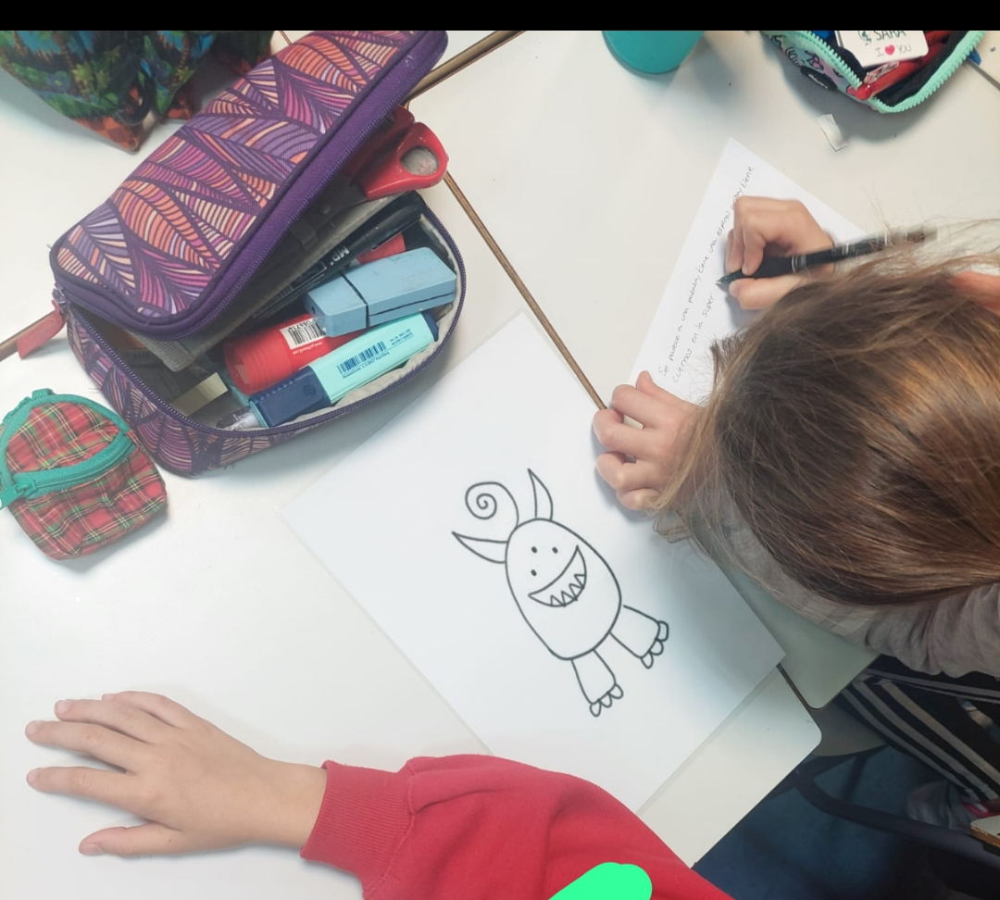

This activity consisted of explaining the concept of **algorithms** to **primary school children**. After the explanation, they worked on it through **drawings** in working groups of a maximum of 4 people. Each group had to write the algorithm to draw the character they had been assigned. Afterwards, another group followed this algorithm and tried to draw the character on the blackboard.
This activity lasted one hour and **70 children** from 3 different classes of CEIP Pedro Duque (Madrid, Spain) participated. 
The activity took place during the week of 11 February (International Day of Women and Girls in Science).

